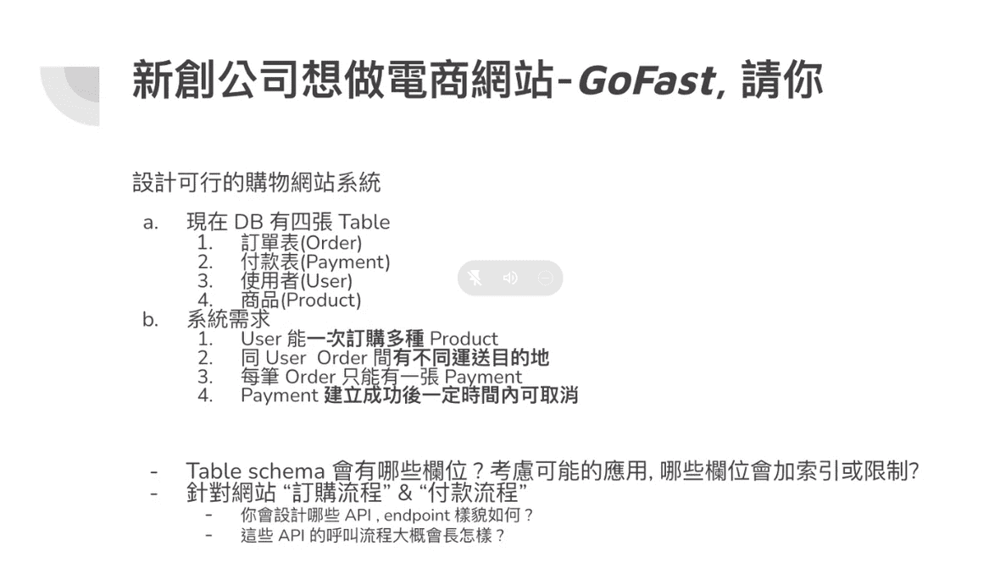
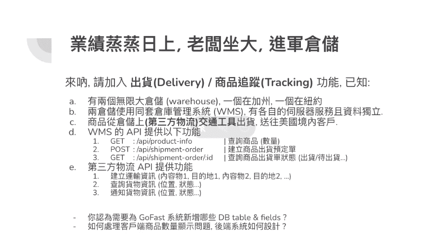

# System Design

1. 
```
1M Active User
1K QPS for whole backend server
請設計一個 Rate Limiter。
```

2. [Go freight](https://gocreating.lation.app/blog/interview/go-freight)



3. If you were to design an indented URL generator today, how would you design it?


4. Please design a recently viewed product feature for an e-commerce website. How would you store the data? How would you retrieve the data? How would you update the data? How would you delete the data? How would you scale the data?
    <details>
    <summary>Answer</summary>

    </details>

5. When would you apply asynchronous communication between two systems? 
    <details>
    <summary>Answer</summary>
      In asynchronous communications, the client sends a request to the server (typically requiring lengthy processing), while receiving a delivery acknowledgment immediately.
      After the client receives the acknowledgment, it carries on with other tasks and will be notified eventually when the server finishes processing the request. The main benefit of asynchronous communications is improved performance.
      Asynchronous communications can be applied in situations where the response is not required immediately, and the current process can continue without the response. Real-world examples can include email, Slack, and other messaging platforms.
    </details>

  6. In what situation would you choose RDBMS and where would you choose NoSQL?
  7. In what cases is a microservices architecture better than a monolithic one?
     <details><summary>Answer</summary>
        A monolithic application is constructed as a cohesive entity, whereas a microservices architecture comprises smaller, individually deployable services.

        Microservices are not a panacea, but they alleviate many issues for developing software and businesses.

        Because a microservices architecture is made up of pieces that run separately, each service may be built, upgraded, distributed, and scaled independently of the others. Software upgrades may be carried out more often, resulting in higher dependability, availability, and performance.

        They are therefore perfect for big data apps, modernization and phasing out of legacy apps (for example, those typically upgraded by Salesforce developers), real-time data processing, adoption of the DevOps model, multi-group developments, and other projects that require the unique benefits offered by microservices.l-world examples can include email, Slack, and other messaging platforms.
      </details> 
8. In which situation would you implement asynchronous communication with different systems?
9. Which method would you use to handle large amounts of data with limited memory?
10. How would you select a cache strategy (e.g., LRU, FIFO)?
11. 项目细节讲解，流程图，瓶颈在哪儿

项目整体架构 共包含哪些服务 服务之间信息流是如何流转的 在项目中，有没有遇到什么难点 有没有排查过项目的线上问题 你觉得你现在的设计有什么问题么？ 如果你负责的服务从100TPS变成1万TPS会有什么问题？怎么处理？ 如果你负责的这个功能之后需要频繁变更，你怎么设计？ 等等等

12. QPS，如何压测，性能测试，性能指标，性能优化。
13. 秒杀场景设计
14. 高并发
15. 分布式锁实现方案。
16. 1G 内存，1T 文件，想找到出现次数第二大的字符串。
17. 项目架构图，自我感觉项目难点，现在再让你重新做这个项目你会有什么修改跟调整
18. 常用的负载均衡算法，自己选择个负载均衡算法来实现并进行自测。
19. 常用限流方法，自己咋实现。
29. 分布式链路追踪的实现跟理解。
30. Nginx 的實現原理是什麼？為什麼一台 Nginx Server 就可能撐上萬的 QPS？
31. Design a game sign in mission system
32. Design a shorten URL system
33. Design a booking system
34. What is CAP?
    <details><summary>Answer</summary>
    - Consistency: A read is guaranteed to return the most recent write for a given client
    - Availability: A non-failing node will return a reasonable response within a reasonable amount of time (no error or timeout).
    - Partition Tolerance: The system continues to operate despite an arbitrary number of messages being dropped (or delayed) by the network between nodes.

    According to the CAP theorem, a distributed data store can only provide two of the three guarantees. In other words, it is impossible for a distributed data store to simultaneously provide all three guarantees.
    <details>

35. Brewer's Theorem, most commonly known as the CAP theorem, states that in the presence of a network partition (the P in CAP), a system's designer has to choose between consistency (the C in CAP) and availability (the A in CAP). Can you think about examples of CP, AP and CA systems?
    <details><summary>Answer</summary>
    - CP: Means the system can ensure consistency and partition tolerance, but not availability. In this case, the system will not respond to the client when the network partition occurs.
    example: 
    - AP: Means that the system will continue to operate despite an arbitrary number of messages being dropped (or delayed) by the network between nodes. The response may not be the most recent write, but it will be a reasonable response.
    - CA: Means user will get response and write data, the partition will not work. But since we are discussing distributed system, the partition will happen, so CA is not a good choice.
    </details>

## References
- [設計秒殺系統](https://mp.weixin.qq.com/s/kWqgzMw4qKek7QUfkDSwNg)
- [異地多活](https://mp.weixin.qq.com/s/T6mMDdtTfBuIiEowCpqu6Q)
